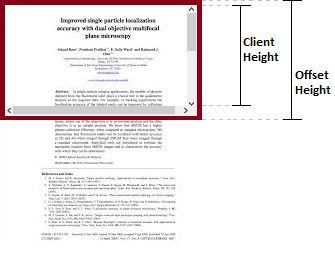

# Javascript Element dimentions

## What is offsetHeight, clientHeight, scrollHeight?

REF : https://stackoverflow.com/questions/22675126/what-is-offsetheight-clientheight-scrollheight

To know the difference you have to understand the box model, but basically:

**clientHeight:**

Returns the inner height of an element in pixels, including padding but not the horizontal scrollbar height, border, or margin

**offsetHeight:**

OffsetHeight, is a measurement which includes the element borders, the element vertical padding, the element horizontal scrollbar (if present, if rendered) and the element CSS height.

**scrollHeight:**

is a measurement of the height of an element's content including content not visible on the screen due to overflow

# Deep in Browser Viewport and Dimentions

REF : http://ezcook.de/2017/06/05/Deep-in-Viewport/

**Screen Size**

`screen.width` and `screen.height` means the total width width and height of the user’s screen. These dimensions are measured in device px because they never change: they’re feature of the monitor and not of the browser.

**Window Size**

`window.innerWidth` and `window.innerHeight`

**Scrolling Offset**

`window.pageXOffset` and `window.pageYOffset` contains the horizontal and vertical scrolling offsets of the document. Thus you can find out how much the user has scrolled.

